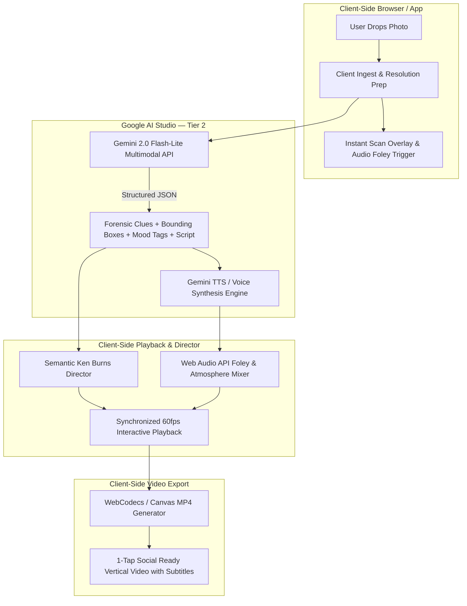

# Expose — System Architecture & Specification

**Project:** Expose (`exposuresearch.com`)  
**Core Hook:** Upload any photo and hear its story narrated aloud as a cinematic, forensic mini-film with synchronized Ken Burns camera motion and layered atmospheric audio.

---

## 1. System Architecture Overview



---

## 2. Core Modules & Technical Specifications

### Module 1: Ingestion & Resolution Preparation
* **Client-Side Ingest:** Accepts standard image formats (`JPG`, `PNG`, `WEBP`, `HEIC`).
* **Aspect Ratio & DPI Handling:** Normalizes viewport orientation (vertical 9:16 or portrait 4:5 focus).
* **Super-Resolution / Detail Prep:** Uses high-quality canvas bicubic filtering or WebGPU on-device sharpening to avoid pixelation when the Ken Burns camera zooms $2.5\times$ into vintage or low-res photos.

---

### Module 2: Multimodal Forensics Engine (`gemini-2.0-flash-lite`)

Instead of generic storytelling prompts, the engine executes a **Forensic Clue-Anchoring Pipeline** in a single round-trip:

1. **Contextual Mood & Texture Inference:** Extracts dynamic tags from lighting, era, posture, and grain (e.g. `["quiet tension", "faded polaroid warmth", "1978 suburban dusk"]`).
2. **Physical Clue Detection:** Locates 3–5 hyper-specific, idiosyncratic physical details in the photo with normalized bounding box coordinates (`[ymin, xmin, ymax, xmax]` on a 0–1000 grid).
3. **Grounded Script Generation:** Crafts a punchy, tightly paced script that moves sequentially through the physical clues. Because every photo's micro-details are unique, stories never repeat generic tropes.

#### Structured Output Schema (JSON)
```typescript
interface ForensicInvestigationResult {
  era_estimate: string;
  contextual_mood_tags: string[];
  ambient_sound_profile: "tape_hiss_polaroid" | "noir_rain_traffic" | "windy_coast_gulls" | "muffled_parlor_clock" | "suburban_cicadas_summer";
  total_duration_sec: number;
  clues: ForensicClue[];
}

interface ForensicClue {
  clue_id: string;
  timestamp_sec: number;
  observation: string;
  bounding_box_2d: [number, number, number, number]; // [ymin, xmin, ymax, xmax] 0-1000
  zoom_depth: number; // e.g. 1.8 to 2.5
  narration_line: string;
}
```

---

### Module 3: Layered Sound Staging & Foley Mixer

Raw AI speech sounds sterile. The audio engine layers a dynamic, era-appropriate soundscape using the **Web Audio API**:

* **Channel 1 (Voice Track):** High-clarity TTS voice stream with slight room warmth.
* **Channel 2 (Ambient Foley):** Continuous background texture loop matched to `ambient_sound_profile` (vinyl crackle, gentle rain against glass, analog tape hiss, distant clock tick).
* **Dynamic Audio Ducking:** Foley automatically attenuates by -6dB during active narration and swells softly during narrative pauses.

---

### Module 4: Semantic Ken Burns Director

Rather than an arbitrary center zoom, the camera glides dynamically between detected evidence coordinates:

* **Coordinate Interpolation:** Converts normalized bounding box centers into CSS / Canvas 3D transform matrices:
  $$\text{targetX} = \frac{xmin + xmax}{2}, \quad \text{targetY} = \frac{ymin + ymax}{2}$$
* **Smooth Easing:** Utilizes custom cubic-bezier curves (`cubic-bezier(0.25, 1, 0.5, 1)`) for cinematic camera drifts.
* **Timeline Synchronization:** Audio playback `currentTime` drives the transition checkpoints between clue targets.

---

### Module 5: Client-Side Social Export Engine

* **Zero Cloud Render Cost:** Renders the vertical 9:16 video directly in the user's browser using HTML5 Canvas + WebCodecs / `MediaRecorder`.
* **Export Artifacts:**
  * High-framerate MP4 / WebM video file.
  * Burned-in animated kinetic subtitles (karaoke-style or typewriter).
  * Audio spectrum / evidence tag overlays.
  * Direct 1-tap download or Web Share API integration (TikTok, Instagram Reels, Messages).

---

## 3. Technology Stack

| Layer | Technology | Rationale |
| :--- | :--- | :--- |
| **Frontend Core** | React / Vite + TypeScript | Blazing fast build, lightweight client runtime, zero server overhead. |
| **Styling & Aesthetics** | Modern Vanilla CSS | Sleek darkroom/dossier aesthetic, custom glassmorphism, hardware-accelerated 3D transforms. |
| **AI Inference** | Google AI Studio (`gemini-2.0-flash-lite`) | Sub-second multimodal vision inference, Tier 2 high-throughput concurrency, structured JSON schema. |
| **Audio Processing** | Web Audio API | Client-side dual-track mixer, procedural foley loops, dynamic audio ducking. |
| **Video Rendering** | HTML5 Canvas + WebCodecs / MediaStream | Zero-cost client-side video composition and MP4 export. |

---

## 4. Implementation Roadmap

1. **Phase 1: Project Scaffolding & Design System**
   - Initialize Vite React TypeScript project.
   - Establish Darkroom/Dossier aesthetic design tokens (palette, typography, animations).
2. **Phase 2: Gemini Forensics Pipeline**
   - Implement Gemini 2.0 Flash-Lite multimodal client with structured JSON output.
   - Set up clue extraction and mood-tag inference.
3. **Phase 3: Semantic Ken Burns Canvas Engine**
   - Build coordinate-driven pan/zoom canvas player with smooth easing transitions.
   - Implement evidence bounding box overlays.
4. **Phase 4: Audio Staging & Foley Mixer**
   - Implement TTS playback with synced timestamp tracking.
   - Add ambient Web Audio soundscape profiles and dynamic ducking.
5. **Phase 5: Client-Side Export & Social Sharing**
   - Build client-side video recorder with burned-in subtitles.
   - Verify 1-click sharing flow and responsive layout.
